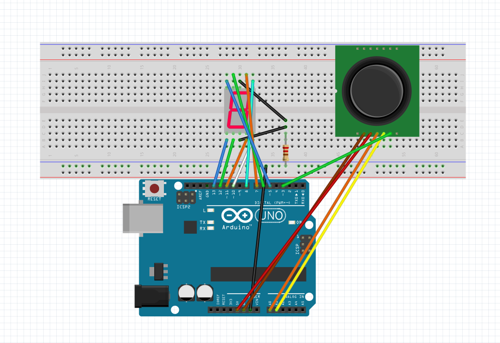
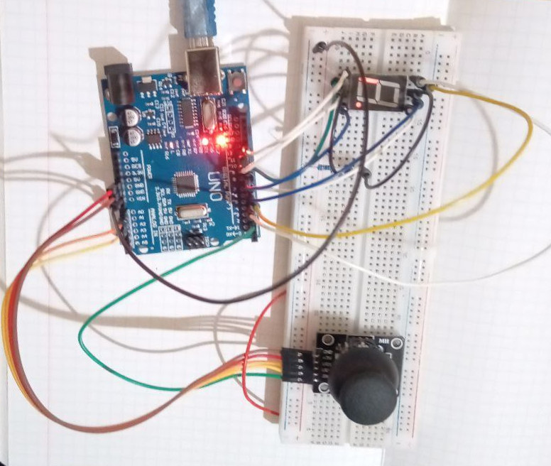

# Joystick -> 1 Display

Відображає положення повзунка джойстика на одному з 7 сегментів цифрового дисплею.

## Hardware Required

* Arduino Board
* Joystick module
* 7-segment 1 Digit display
* Hook-up wires

## Схема

Мій джойстик має п'ять виходів: GND, VCC, VRx, VRy, SW
Перші два відповідають за живлення (коричневий і червноний провід), VRx та VRy - за позицію джойстика по x та y координатам (оранжевий та жовтий) і SW - за натискання на кнопку (хз як точно перекласти pushbutton, провід зелений) 

Дисплей 5161as легко підключається по цьому даташиту http://www.xlitx.com/datasheet/5161AS.pdf 

## Результат

