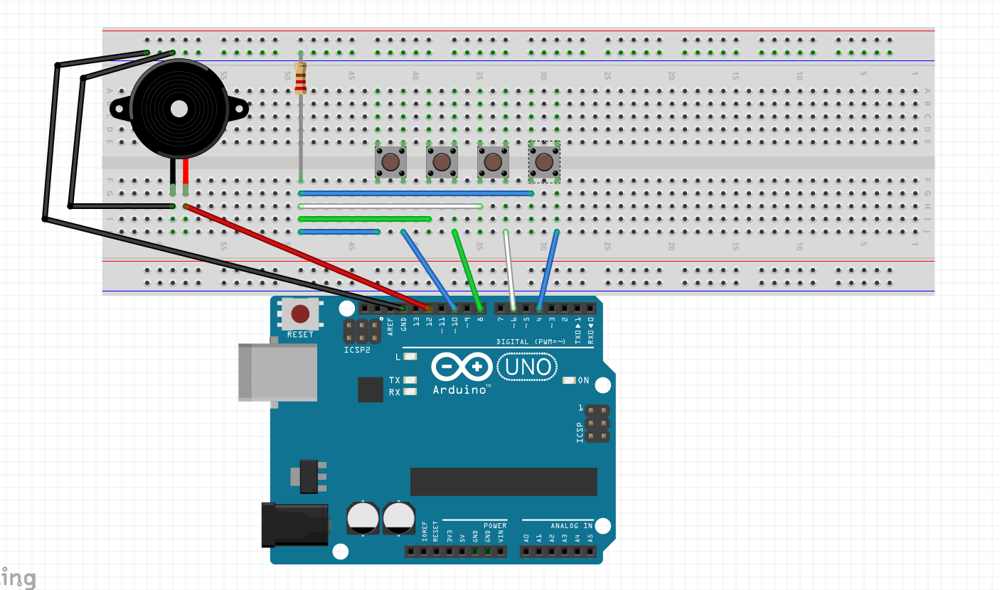
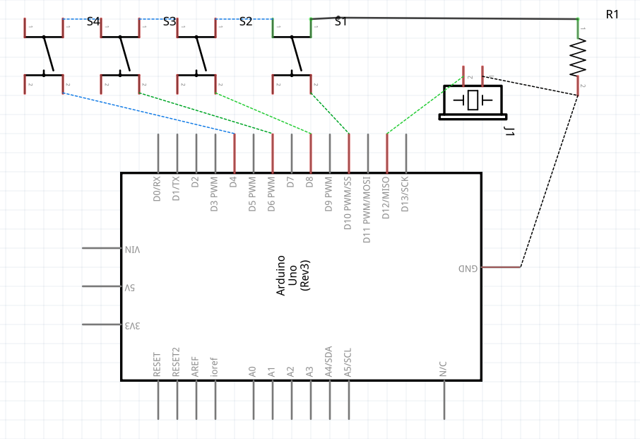
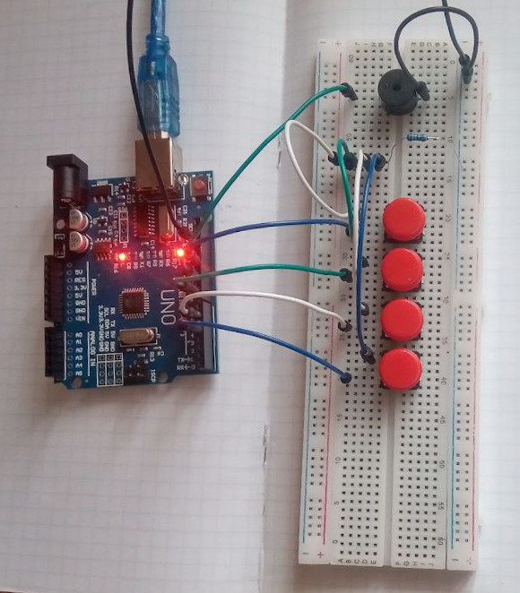

# Pianino

Ідея доволі проста, динамік грає ноти при натисканні на відповідні кнопки.  

## Hardware Required

* Arduino Board
* Pushbuttons (чим більше тим краще)
* Resistor (10k Ohm seems good)
* Piezo buzzer
* Hook-up wires

## Схема

Для кнопок один вихід підключається на цифровий пін ардуїнки, інший - на GND.
Аналогічно і для динаміка.

## Результат

